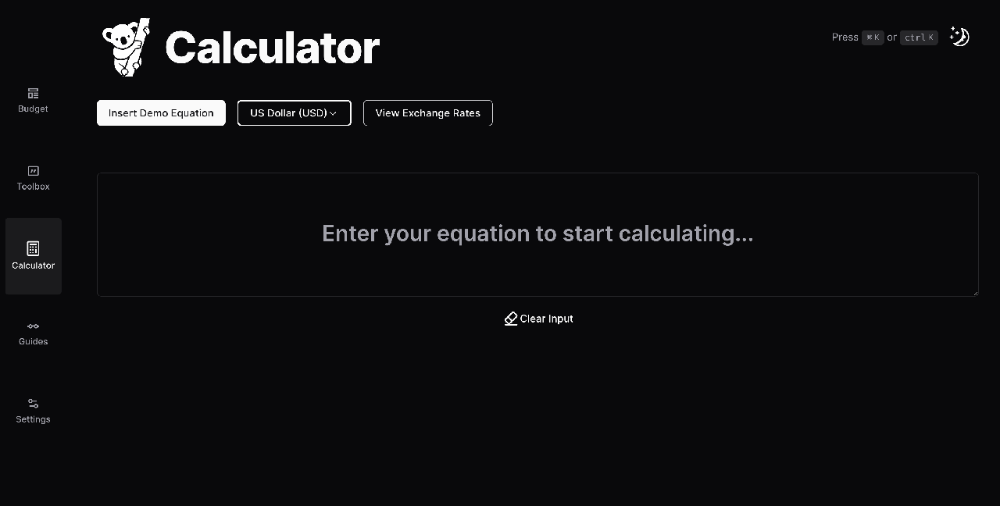

# Koala

Koala offers a user-friendly interface for performing financial calculations and managing financial data efficiently. It supports many currencies as well as mixed currency equations.


## Stack

- [Next.js](https://nextjs.org/)
- [React](https://reactjs.org/)
- [Tailwind CSS](https://tailwindcss.com/)
- [MDX](https://mdxjs.com/)
- [Dinero.js](https://dinerojs.com/)
- [Framer Motion](https://www.framer.com/api/motion/)
- [Math.js](https://mathjs.org/)

## Getting Started

### Prerequisites

- Node.js (v14.0.0 or later)
- Yarn (v1.22.19 or later)

### Installation

1. Clone the repository:
   ```
   git clone https://github.com/raslan/koala.git
   ```
2. Navigate to the project directory:
   ```
   cd koala
   ```
3. Install dependencies:
   ```
   yarn install
   ```
4. Start the development server:
   ```
   yarn dev
   ```

## License

This project is licensed under the MIT License - see the [LICENSE](LICENSE) file for details.